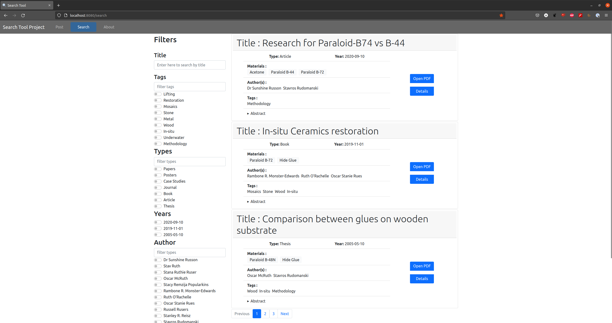

# Search Tool Project
## Description

This application has been created with the aim to help conservators in finding relative publications according to the materials used in the research.

This would allow for the user to navigate the publication according to the materials they have available to find the options an techniques possible.
This was done as part of a self learning process and thesis for the Technological Educational Institute of Athens, Department of Conservation of Antiquities and Works of Art. 

## Table of Contents
1. [Description](#description)
1. [Technologies Used](#technologies-used)
1. [Usage and Screenshots](#usage-and-screenshots)
1. [Setup](#setup)
1. [Project Status](#project-status)
1. [Room for Improvement](#room-for-improvement)
1. [Acknowledgments](#acknowledgments)
1. [Contact](#contact)


## Technologies Used
- Python 3.8.5
- PostgreSQL 14.5
- Django 3.1.6
- Django REST framework 3.13.0
- Vue 3 Js


## Usage and Screenshots
In the project's directory run
```
$ python manage.py runserver
```
This will run the back-end Django server which will then be ready to serve the front-end part.

Open another window and navigate to 
```
$ cd frontend/frontend/
```
After that run the front-end server as well 
```
$ npm run serve 
```
If setup is default navigate to http://localhost:8080/search and you should reach the page below .

This is a screenshot of the search in which by switching the toggles on and of the results will be updated to match the selected items.
The "Open PDF" button on the right will open the publication file in a new tab and the "Details" button will open the detailed view of each publication.

The text input over every search field is responsive and will filter the available options to present only the ones matching the input.



## Setup
In this section I will describe how to set this project up. The description might seems too detailed but this is how I would appreciate finding it as new to programming.

It is suggested to use a virtual environment when setting up, this way your local system will remain unaffected by the packages involved 

**[Here](https://realpython.com/intro-to-pyenv/#virtual-environments-and-pyenv)** is a great guide to using pyenv which has really helped me

### Prerequisites 
1. PostgreSQL 14.5
    1. create a database named "search_tool_db"
    2. A user for connecting to the database
        - USER: 'searchtooladmin'
        - PASSWORD: '123pass'
1. Python version 3.8.5

### Setup process

1. Clone the repository (this will download all the files in this repository).
    ```
    $ git clone https://github.com/AndreasGkizis/search_tool_project.git
    ```
2. Move inside the Directory to have access to the files needed.
    ```
    $ cd search_tool_project/
    ```
3. Install all the required packages for it to run as intended.
    ```
    $ pip install -r requirments.txt
    ```
4. Migrate the tables and schema to the PostgreSQL database according to the models of Django.
     ```
    $ python manage.py migrate
    ```
5. Since now the schema is created we can populate it with data I have created for the demonstration of the wed-page's functionality.
    ```
    $ python manage.py loaddata search_tool_app/fixtures/initial_appdata.json
    ```
9. Navigate inside the front-end folder and install vue/cli
    ```
    $ cd frontend/frontend && npm install @vue/cli
    ```

## Project Status

This project is currently under development =)

## Room for Improvement
I must admit there are a lot still I would like to add to this project, below you can find the list.

To do:
- Add tests
- Add the option of posting new publications from the Post page
- Ability to export a number of selected publications (in CSV?)
- Dockerise
- Adjust UI to handle large numbers of search options ("show more" button under each field and sort Alphabetically )
- Make Year field a slider design
- And more !


## Acknowledgments

**Many thanks to [Sergios Aftsidis](https://github.com/safts) and [Panagiotis Spirou](https://github.com/panagspirou) for the help and guidance throughout this :)**


## Contact
Created by me [Andreas Gkizis](https://github.com/AndreasGkizis) 
! - feel free to contact me regarding any suggestions tips or whatever else! 

**Any feedback will be much appreciated**
